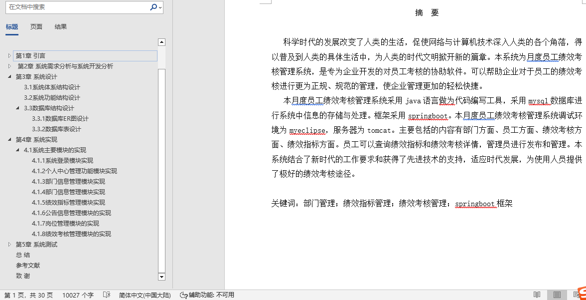
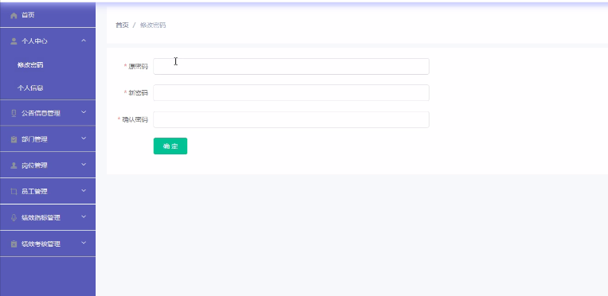
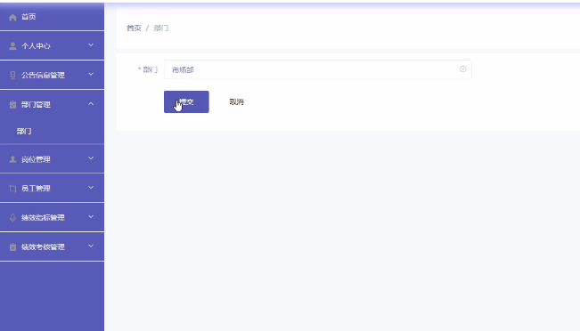
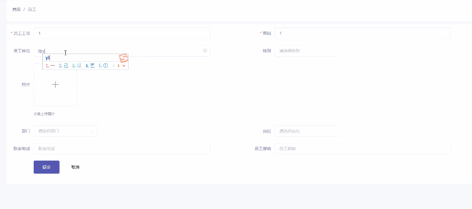
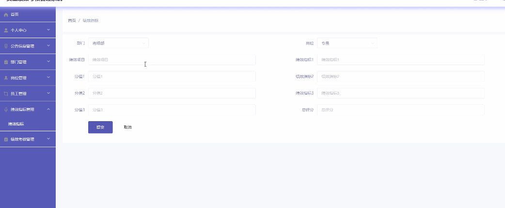
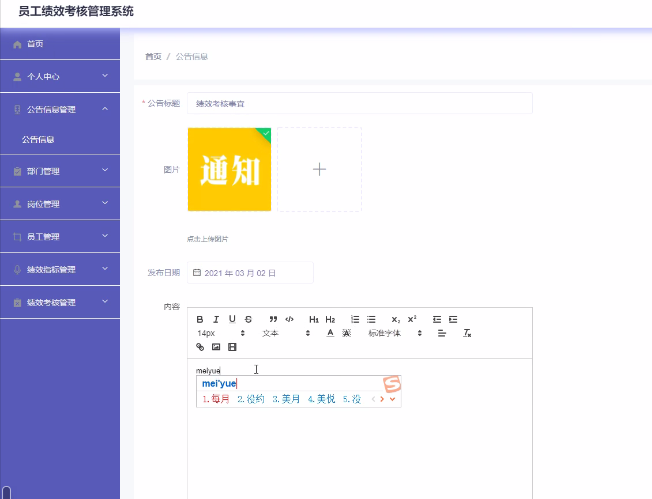
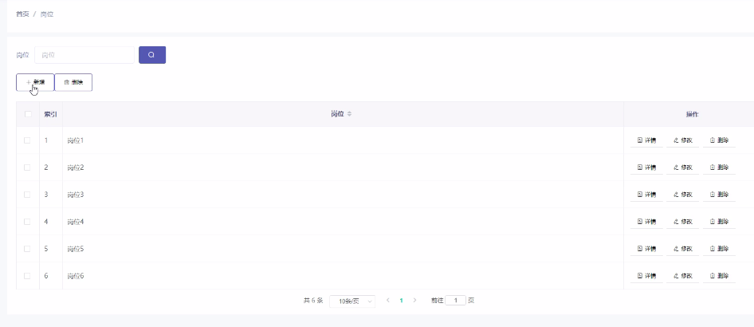
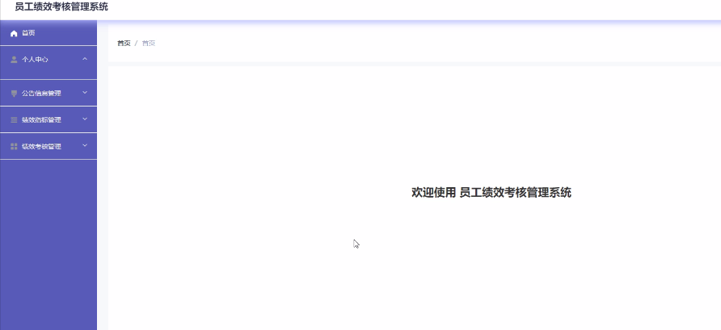

## 月度员工绩效考核管理系统(程序+报告)

###  获取sql数据库文件: 从戎源码网 (https://armycodes.com/) QQ: 386869957 QQ群: 377586148
###  所有系统地址: (https://github.com/YuLin-Coder/AllProjectCatalog) 
###  所有项目以及源代码本人均调试运行无问题 可支持远程安装部署调试、定制修改、代码讲解

## 项目介绍
月度员工绩效考核管理系统，系统包含两种角色：用户、管理员，系统分为前台和后台两大模块，主要功能如下：

管理员功能模块
系统登录: 用户选择角色并登录。
个人中心管理: 管理员设置账号和密码。
部门信息管理: 管理员添加和查询部门信息。
员工信息管理: 管理员添加员工信息，安排部门和备注。
绩效指标管理: 管理员添加绩效指标。
公告信息管理: 管理员发布公告。
岗位管理: 管理员分配和查询员工岗位。
绩效考核管理: 管理员发布绩效考核信息。

员工功能模块
功能描述: 员工查询公告、绩效指标和绩效考核信息，修改个人资料和密码。

## 项目技术
- 编程语言：Java
- 数据库：MySQL
- 项目管理工具：Maven
- 前端技术：HTML、CSS、JavaScript、Vue
- 后端技术：Spring、SpringMVC、MyBatis

## 运行环境
- JDK版本：JDK1.8及以上
- 开发工具：IDEA、Ecplise、Myecplise都可以
- 数据库: MySQL5.7及以上
- Maven：maven3.0及以上
- Node：14.14.0及以上

## 运行截图

